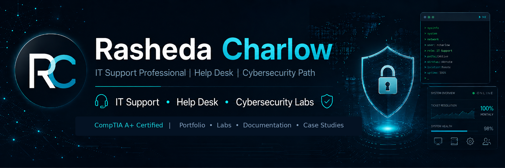

<p align="center">
  
</p>

<h1 align="center">Hi, I'm Rasheda Charlow</h1>

<p align="center">
  <strong>IT Support Professional | Help Desk | Cybersecurity Path</strong>
</p>

<p align="center">
  CompTIA A+ Certified &nbsp;|&nbsp; Security+ Candidate &nbsp;|&nbsp; Building practical support and security labs
</p>

## About Me

I am transitioning into IT support after more than 20 years of professional experience supporting executives, coordinating complex work, documenting processes, and helping teams stay organized. I earned my **CompTIA A+ certification** and completed **357 hours of hands-on IT support training through Per Scholas**.

I am building this portfolio to demonstrate practical skills in Windows troubleshooting, help desk documentation, Active Directory support, networking fundamentals, PowerShell, and security-focused problem solving. My long-term goal is to grow into cybersecurity and digital forensics work that helps protect vulnerable people.

## Certifications and Training

- **CompTIA A+** — Certified
- **CompTIA Security+** — Candidate; exam planned for June 2026  
- **Per Scholas IT Support Training** — Graduate; 357 hours of hands-on training

## Technical Skills

**IT Support:** Windows 10/11, hardware installation, software troubleshooting, user support, printer setup, Microsoft 365  
**Windows Administration Labs:** Hyper-V, Windows Server, Active Directory, users and groups, OUs, password resets, Group Policy basics  
**Networking:** TCP/IP, DNS, DHCP, Wi-Fi troubleshooting, SOHO routers and switches, `ipconfig`, `ping`, `nslookup`  
**Tools and Documentation:** PowerShell, Command Prompt, Event Viewer, Device Manager, ticket documentation, knowledge base articles

## Featured Portfolio Projects

| Project | Skill Evidence | Status | Link |
|---|---|---:|---|
| **HarborLight Help Desk Lab** | Hyper-V, Windows support, ticket documentation | Building | [Add repository link] |
| **Active Directory User Support Lab** | Accounts, groups, password resets, DNS/domain join troubleshooting | Planned | [Add repository link] |
| **HCS Knowledge Base Library** | End-user documentation and clear instructions | Building | [Add repository link] |
| **PowerShell Help Desk Toolkit** | Practical support commands and scripts | Planned | [Add repository link] |
| **Cybersecurity Case Studies** | Sanitized analysis and security documentation | Planned | [Add repository link] |

## Currently Working On

- Building a **Hyper-V** virtual lab for the fictional organization **HarborLight Community Services, Inc.**
- Practicing Windows support scenarios and documenting resolutions like a help desk technician
- Preparing for CompTIA Security+
- Developing documentation that shows both technical skill and customer-focused communication

## Portfolio Repositories to Build

```text
hcs-help-desk-lab
hcs-active-directory-support-lab
hcs-knowledge-base-articles
powershell-help-desk-toolkit
windows-troubleshooting-case-studies
cybersecurity-investigation-labs
```

## Connect With Me

- **GitHub:** `rncharlow`
- **LinkedIn:** [(https://www.linkedin.com/in/rncharlow)]
- **Location:** New York City Metropolitan Area

---

<p align="center">
  <em>Support users. Document clearly. Secure what matters.</em>
</p>
