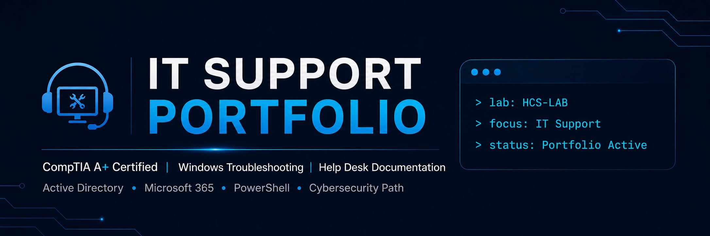

  

<!--
PROFILE README FOR: https://github.com/rncharlow

SETUP BEFORE PUBLISHING:
1. Create a public repository named exactly: rncharlow
2. Add your final GitHub banner to: assets/github-banner.png
3. Link each portfolio project as it is completed.
4. Do not add Security+ Certified until you officially pass the exam.
-->

  

# Hi, I'm Rasheda 👋

### CompTIA A+ Certified | IT Support • Help Desk • Desktop Support

I’m a **CompTIA A+ certified IT professional** and **Per Scholas graduate** bringing more than 20 years of experience supporting people, solving problems, protecting confidential information, and communicating clearly in fast-paced environments.

What draws me to IT support is simple: **I like helping people solve problems that are stopping them from doing their work.** Throughout my career, I’ve been the person others relied on to stay calm, listen carefully, organize the details, and follow through until an issue was resolved.

I’m building a hands-on portfolio around **Windows troubleshooting, help desk documentation, customer-focused technical support, and practical IT lab work**. My goal is to show not only what I know, but how I approach a problem, document the solution, and support the end user professionally.

---

## 🔧 What I'm Building

My portfolio is based around **HarborLight Community Services, Inc. (HCS)**, a fictional organization I created to practice realistic IT support scenarios.

**Lab environment:** `HCSLAB.local`  
**Platform:** Hyper-V  
**Focus:** End-user support, Windows administration, Active Directory, troubleshooting, ticket documentation, and knowledge base writing

Current and upcoming portfolio work:

- Windows 11 and Windows Server virtual lab setup in Hyper-V
- Active Directory users, groups, organizational units, and Group Policy
- Help desk tickets written from realistic end-user issues
- Knowledge base articles written for non-technical users
- Printer, network connectivity, login, Microsoft 365, and Windows troubleshooting scenarios
- Basic security and incident documentation as my skills grow

---

## 🧰 Technical Toolkit

**Support & Operating Systems**  
Windows 10/11 • Microsoft 365 • Hardware and software troubleshooting • Printer support • Mobile device support • Ticket documentation

**Networking Fundamentals**  
TCP/IP • Wi-Fi and SOHO networking • IP configuration • DNS and DHCP fundamentals • `ipconfig` • `ping` • Basic connectivity troubleshooting

**Windows Administration & Labs**  
Hyper-V • Windows Server • Active Directory • Group Policy • User and computer management • PowerShell fundamentals

**Customer Support Strengths**  
Clear communication • Active listening • Documentation • De-escalation • Confidentiality • Follow-through • Customer-first problem solving

---

## 🗂️ Portfolio Projects

> I am building this portfolio intentionally. Each completed project will show the problem, my troubleshooting or configuration process, the solution, sanitized screenshots, documentation, and what I learned.

### Help Desk & Desktop Support

| Project | What It Demonstrates | Status |
|---|---|---|
| HCS Hyper-V Help Desk Lab Setup | Building a realistic Windows support environment | In Progress |
| Windows Troubleshooting Ticket Series | Diagnosing and documenting common end-user issues | Planned |
| Knowledge Base Article Library | Explaining technical fixes clearly for end users | Planned |

### Windows Administration

| Project | What It Demonstrates | Status |
|---|---|---|
| HCS Active Directory Setup | Domain configuration, users, groups, and computers | Planned |
| HCS OU and GPO Design | Organized administration and policy-based troubleshooting | Planned |

<!--
When a repository is completed, replace a project name with its link, for example:
[HCS Hyper-V Help Desk Lab Setup](https://github.com/rncharlow/hcs-hyperv-help-desk-lab)
-->

---

## 📄 How I Document My Work

In each completed project, I aim to include:

- A clear description of the user problem or business need
- Tools and systems used
- Step-by-step troubleshooting or configuration work
- Screenshots showing results with sensitive details removed
- Help desk ticket notes or knowledge base documentation
- A reflection on what I learned and how the skill applies in a real support role

---

## 🎓 Certification & Training

- **CompTIA A+ Certified**
- **Per Scholas IT Support Training Graduate** — 357 hours of hands-on technical training

I am continuing to grow my skills in Windows support, networking, security fundamentals, and technical documentation.

---

## 💼 My Background

Before moving into IT support, I spent more than 20 years supporting executives, teams, and customers in fast-paced environments. That experience taught me how to communicate calmly, organize information carefully, protect confidential data, and solve problems with professionalism.

I bring those same strengths into IT support: **listen carefully, investigate thoroughly, document clearly, and make sure the person needing help feels supported.**

---

## 🎯 Career Goal

I am seeking an entry-level **IT Support, Help Desk, or Desktop Support** opportunity where I can bring strong customer service, professionalism, and growing technical skills to an end-user support team.

Long term, I plan to grow into cybersecurity and digital forensics, with a focus on work that helps protect vulnerable people from cybercrime.

---

## 🤝 Connect With Me

- [LinkedIn](https://www.linkedin.com/in/rncharlow)
- GitHub: [@rncharlow](https://github.com/rncharlow)

---

  <em>Customer-focused support • Clear documentation • Continuous learning</em>

